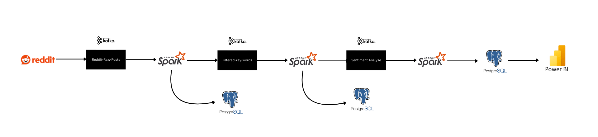

# Reddit Stream Sentiment Analysis

This project performs **real-time** and **batch** sentiment analysis on Reddit posts using **Apache Spark Structured Streaming**, **Kafka**, **PostgreSQL**, and **VADER Sentiment Analysis**.

It ingests Reddit posts, filters them by keywords, analyzes their sentiment, aggregates results over time windows, and stores outputs in both Kafka and PostgreSQL.

---

## 🛠 Architecture Overview



<!-- 👉 Replace the above link with your uploaded image link in GitHub -->

### Real-time Streaming
- **Filter** Reddit posts by a keyword from the Kafka topic `reddit-raw-posts`.
- **Analyze Sentiment** using VADER on the filtered posts from `reddit-keyword-filtered`.
- **Aggregate** positive, negative, and neutral posts per 1-minute window.
- **Save** the results to PostgreSQL and Kafka (`sentiment_analyse` topic).

### Batch Processing
- **Load** saved sentiment data from PostgreSQL (`sentiment_results` table).
- **Perform batch aggregation** based on ingestion timestamps (1-minute window).
- **Write** aggregated results into PostgreSQL table `sentiment_aggregated_batch`.

---

## 📚 Technologies Used

- **Apache Spark Structured Streaming & Batch Processing**
- **Apache Kafka**
- **PostgreSQL**
- **VADER Sentiment Analysis (Python)**
- **Python (PySpark)**

---

## 📦 Kafka Topics

| Topic Name               | Description                                    |
|---------------------------|------------------------------------------------|
| `reddit-raw-posts`        | Raw unfiltered Reddit post JSON data.         |
| `reddit-keyword-filtered` | Posts filtered by a keyword in the title.     |
| `sentiment_analyse`       | Posts with sentiment analysis result.         |

---

## 🗄 PostgreSQL Tables

| Table Name                  | Description                                              |
|------------------------------|----------------------------------------------------------|
| `reddit_keyword_filtered`    | Raw posts after keyword filtering.                      |
| `sentiment_results`          | Posts with sentiment labels and ingestion timestamps.   |
| `sentiment_aggregated`       | Real-time aggregated sentiment counts over 1-minute windows. |
| `sentiment_aggregated_batch` | Batch aggregated sentiment counts (offline analysis).   |

---

## 🚀 How to Run Locally

1. **Start Services**
   - Start Zookeeper, Kafka, and PostgreSQL.

2. **Create Database**
   ```bash
   createdb reddit_stream_db
   ```

3. **Install Required Python Packages**
   ```bash
   pip install pyspark kafka-python vaderSentiment
   ```
   Download PostgreSQL JDBC Driver

4. **Run Streaming Jobs**
   - Start producer in ingestion folder
   - Run `reddit_keyword_filter.py`
   - Run `sentiment_analysis.py`
   - Run `sentiment_window_aggregator.py`

5. **Run Batch Job (Optional)**
   - After some data has been collected, run `sentiment_batch_aggregator.py`.

---
